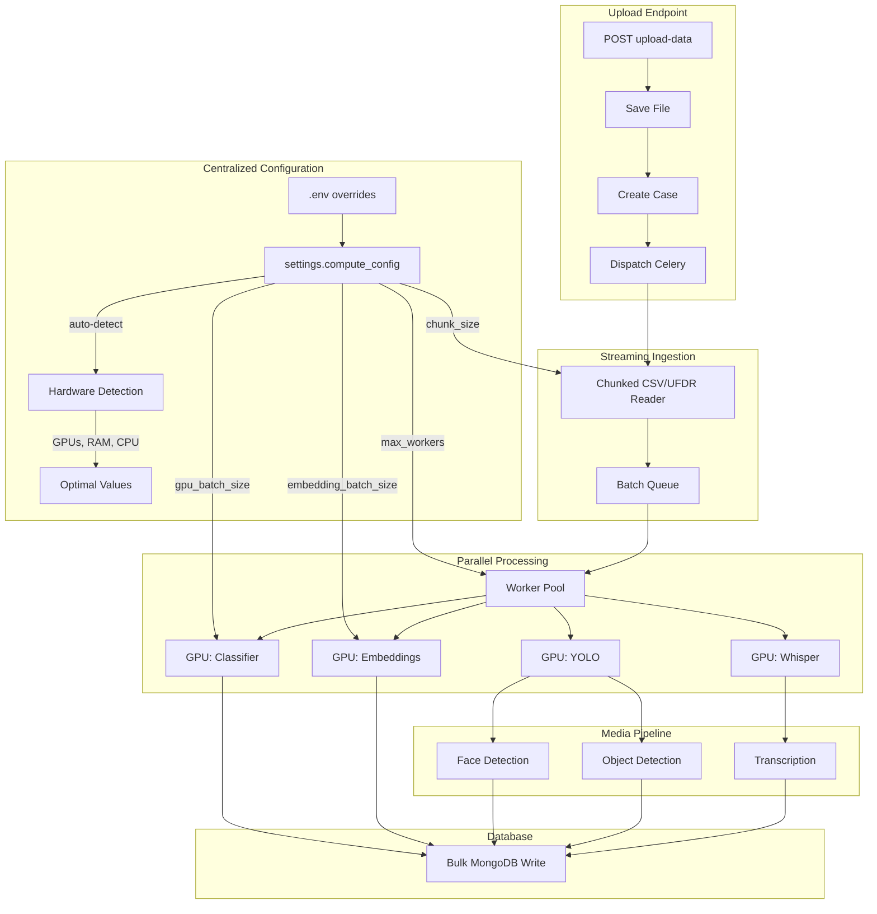

# High-Performance AI Processing Pipeline Optimization

## Current Performance Analysis

Based on the codebase analysis, the current bottlenecks are:

1. **Sequential Celery Task Chain** - UFDR processing in `[celery_tasks.py](celery_tasks.py)` uses sequential chain (`|` operator), causing each task to wait for the previous one
2. **Unused Parallel Config** - `config/parallel_config.py` exists but is only imported in `parallel_processor.py` and not effectively integrated into the pipeline
3. **No Model Pooling** - AI models reload for each Celery task instead of being shared
4. **Synchronous LLM Calls** - Ollama/LLaMA calls block execution
5. **Single GPU Device Usage** - Clients like `[XlmRobertaLargeXnli.py](clients/classifier/XlmRobertaLargeXnli.py)` only use `device=0`
6. **Memory-Bound Data Loading** - Large files fully loaded via `pd.read_csv()` in `[ingester_v1.py](ingester_v1.py)`

## Target Performance

- **20GB file**: 3 hours (~1.85 MB/s throughput)
- **40GB file**: 6 hours (linear scaling)
- **Hardware**: 1+ NVIDIA RTX 5080 (16GB VRAM, ~10,000 CUDA cores)

---

## Phase 1: Centralized Compute Configuration

### 1.1 Remove Unused parallel_config.py

Delete `[config/parallel_config.py](config/parallel_config.py)` and remove its import from `[parallel_processor.py](parallel_processor.py)`:

```python
# REMOVE this import from parallel_processor.py
from config.parallel_config import ParallelConfig
```

### 1.2 Add Compute Settings to settings.py

Add auto-detecting compute configuration to `[config/settings.py](config/settings.py)`:

```python
import torch
import psutil
import multiprocessing as mp

class Settings(BaseSettings):
    # ... existing settings ...
    
    # Parallel Processing Settings (with .env defaults)
    parallel_max_workers: Optional[int] = Field(default=None, env="PARALLEL_MAX_WORKERS")
    parallel_batch_size: Optional[int] = Field(default=None, env="PARALLEL_BATCH_SIZE")
    parallel_gpu_batch_size: Optional[int] = Field(default=None, env="PARALLEL_GPU_BATCH_SIZE")
    parallel_embedding_batch_size: Optional[int] = Field(default=None, env="PARALLEL_EMBEDDING_BATCH_SIZE")
    parallel_max_concurrent_llm: Optional[int] = Field(default=None, env="PARALLEL_MAX_CONCURRENT_LLM")
    parallel_chunk_size: Optional[int] = Field(default=None, env="PARALLEL_CHUNK_SIZE")
    
    @property
    def compute_config(self) -> dict:
        """Auto-detect hardware and return optimal compute configuration."""
        # Detect hardware
        cpu_count = mp.cpu_count()
        ram_gb = psutil.virtual_memory().total / (1024**3)
        gpu_count = torch.cuda.device_count() if torch.cuda.is_available() else 0
        gpu_memory_gb = 0
        if gpu_count > 0:
            gpu_memory_gb = torch.cuda.get_device_properties(0).total_memory / (1024**3)
        
        # Calculate optimal values based on hardware
        # RTX 5080: ~16GB VRAM, can handle large batches
        if gpu_memory_gb >= 16:
            default_batch_size = 256
            default_gpu_batch = 128
            default_embedding_batch = 512
        elif gpu_memory_gb >= 8:
            default_batch_size = 128
            default_gpu_batch = 64
            default_embedding_batch = 256
        else:
            default_batch_size = 32
            default_gpu_batch = 16
            default_embedding_batch = 64
        
        # Workers: 2x CPU cores if GPU available, else 1x
        default_workers = min(cpu_count * (2 if gpu_count > 0 else 1), 32)
        
        # LLM concurrency based on RAM
        default_llm_concurrent = min(int(ram_gb / 2), 32)
        
        return {
            "cpu_count": cpu_count,
            "ram_gb": round(ram_gb, 1),
            "gpu_count": gpu_count,
            "gpu_memory_gb": round(gpu_memory_gb, 1),
            "max_workers": self.parallel_max_workers or default_workers,
            "batch_size": self.parallel_batch_size or default_batch_size,
            "gpu_batch_size": self.parallel_gpu_batch_size or default_gpu_batch,
            "embedding_batch_size": self.parallel_embedding_batch_size or default_embedding_batch,
            "max_concurrent_llm": self.parallel_max_concurrent_llm or default_llm_concurrent,
            "chunk_size": self.parallel_chunk_size or 50000,
        }
```

### 1.3 Add .env Variables

Add to `.env` file (all optional - auto-detected if not set):

```bash
# Parallel Processing Configuration (optional - auto-detected if not set)
# PARALLEL_MAX_WORKERS=16          # Number of worker threads/processes
# PARALLEL_BATCH_SIZE=256          # General batch size for processing
# PARALLEL_GPU_BATCH_SIZE=128      # Batch size for GPU inference
# PARALLEL_EMBEDDING_BATCH_SIZE=512 # Batch size for embedding generation
# PARALLEL_MAX_CONCURRENT_LLM=32   # Max concurrent LLM requests
# PARALLEL_CHUNK_SIZE=50000        # Chunk size for streaming file reading
```

### 1.4 Update parallel_processor.py

Replace `ParallelConfig` usage with centralized settings:

```python
# BEFORE:
from config.parallel_config import ParallelConfig
config = ParallelConfig.get_config()
self.max_workers = max_workers or config.get("max_workers", 4)
self.batch_size = batch_size or config.get("batch_size", 32)

# AFTER:
from config.settings import settings
compute = settings.compute_config
self.max_workers = max_workers or compute["max_workers"]
self.batch_size = batch_size or compute["batch_size"]
self.gpu_batch_size = compute["gpu_batch_size"]
self.embedding_batch_size = compute["embedding_batch_size"]
```

---

## Phase 2: Streaming Data Ingestion

### 2.1 Chunked File Reading

Modify `[ingester_v1.py](ingester_v1.py)` to use chunked reading with centralized config:

```python
from config.settings import settings

async def ingest_csv_streaming(self, file_path):
    chunk_size = settings.compute_config["chunk_size"]
    for chunk in pd.read_csv(file_path, chunksize=chunk_size, encoding=encoding):
        batch = chunk.to_dict(orient="records")
        await self._process_and_insert_batch(batch)
```

### 2.2 UFDR Streaming Extraction

Modify `[ufdr_ingester.py](ufdr_ingester.py)` to extract and process files in parallel streams:

```python
async def ingest_ufdr_streaming(self, file_path):
    with zipfile.ZipFile(file_path, 'r') as zf:
        # Process in parallel streams by file type
        media_files = asyncio.Queue()
        text_files = asyncio.Queue()
        # Stream extraction with async workers
```

---

## Phase 3: GPU-Optimized Batch Processing

### 3.1 Dynamic Batch Sizes from Centralized Config

All AI clients now use `settings.compute_config` for batch sizes:

### 3.2 Model-Specific Batch Optimization

Modify AI clients to use centralized config for batch sizes:

`[clients/classifier/XlmRobertaLargeXnli.py](clients/classifier/XlmRobertaLargeXnli.py)`:

```python
from config.settings import settings

class XlmRobertaLargeXnliClient:
    def __init__(self, device):
        self.batch_size = settings.compute_config["gpu_batch_size"]
        # ... existing init ...
    
    def classify_batch(self, sequences, labels):
        results = []
        for i in range(0, len(sequences), self.batch_size):
            batch = sequences[i:i+self.batch_size]
            results.extend(self.classifier(batch, labels, multi_label=True))
        return results
```

---

## Phase 4: Multi-GPU and Parallel Task Execution

### 4.1 GPU Manager Enhancement

Update `[multi_gpu_opt.py](multi_gpu_opt.py)` to use centralized config and support model distribution:

```python
from config.settings import settings

class EnhancedGPUManager:
    def __init__(self):
        compute = settings.compute_config
        self.gpu_count = compute["gpu_count"]
        self.model_assignments = {}  # Model -> GPU mapping
        
    def assign_model_to_gpu(self, model_name: str) -> int:
        # Round-robin or load-based GPU assignment
        least_loaded = min(self.gpu_usage, key=self.gpu_usage.get)
        self.model_assignments[model_name] = least_loaded
        return least_loaded
```

### 4.2 Parallel Celery Task Chains

Replace sequential chains in `[celery_tasks.py](celery_tasks.py)` with parallel groups:

```python
# Current (sequential):
workflow = task1.si() | task2.si() | task3.si()

# Optimized (parallel where possible):
from celery import group, chain

workflow = chain(
    extract_ufdr_file_task.si(...),
    save_extracted_ufdr_data_task.si(...),
    group(  # Parallel media processing
        detect_faces_task.si(...),
        detect_objects_task.si(...),
        detect_nsfw_images_task.si(...)
    ),
    group(  # Parallel audio/video
        analyze_audio_task.si(...),
        analyze_video_task.si(...)
    ),
    finalize_processing_task.si(...)
)
```

### 4.3 Celery Worker Configuration

Update `[celery_app.py](celery_app.py)` to use centralized config:

```python
from config.settings import settings

# Get compute config for worker settings
compute = settings.compute_config

platform_config = {
    "worker_pool": "prefork",
    "worker_concurrency": compute["max_workers"],  # Auto-detected based on hardware
    "worker_prefetch_multiplier": 4,
    "worker_max_tasks_per_child": 100,
}
```

---

## Phase 5: Model Pooling and Caching

### 5.1 Singleton Model Registry

Create a shared model registry to avoid reloading:

```python
# New file: model_registry.py
import threading
from config.settings import settings

class ModelRegistry:
    _instance = None
    _lock = threading.Lock()
    _models = {}
    
    @classmethod
    def get_model(cls, model_type: str, device_id: int = 0):
        key = f"{model_type}_{device_id}"
        if key not in cls._models:
            with cls._lock:
                if key not in cls._models:
                    cls._models[key] = cls._load_model(model_type, device_id)
        return cls._models[key]
    
    @classmethod
    def get_batch_size(cls, model_type: str) -> int:
        compute = settings.compute_config
        if model_type == "embeddings":
            return compute["embedding_batch_size"]
        return compute["gpu_batch_size"]
```

### 5.2 Warm Model Loading on Worker Startup

Add Celery worker signals to preload models:

```python
# In celery_app.py
from celery.signals import worker_process_init

@worker_process_init.connect
def preload_models(**kwargs):
    from model_registry import ModelRegistry
    ModelRegistry.get_model("classifier")
    ModelRegistry.get_model("toxic")
    ModelRegistry.get_model("emotion")
    ModelRegistry.get_model("embeddings")
```

---

## Phase 6: Optimized Media Processing

### 6.1 Parallel Image/Video Processing

Update `[celery_helpers.py](utils/celery_helpers.py)` for concurrent media handling using centralized config:

```python
from config.settings import settings

async def process_media_batch(media_files: List[str], detector):
    compute = settings.compute_config
    max_concurrent = compute["max_workers"]
    semaphore = asyncio.Semaphore(max_concurrent)
    
    async def process_single(file_path):
        async with semaphore:
            return await asyncio.to_thread(detector.detect, file_path)
    
    return await asyncio.gather(*[process_single(f) for f in media_files])
```

### 6.2 Video Frame Sampling Optimization

Reduce frames processed while maintaining accuracy in `[YoloObjectDetector.py](clients/object_detector/YoloObjectDetector.py)`:

```python
def detect_object_from_video_optimized(self, video_path, output_dir, 
                                        frame_interval=60,  # Process every 2 sec at 30fps
                                        max_frames=100):    # Cap total frames
```

### 6.3 Batch Whisper Transcription

Add batch processing to `[Whisper.py](clients/transcriber/Whisper.py)`:

```python
from config.settings import settings

def transcribe_batch(self, audio_paths: List[str], parallel=True) -> List[Dict]:
    compute = settings.compute_config
    max_workers = min(compute["max_workers"], 4)  # Cap at 4 for audio
    if parallel:
        with ThreadPoolExecutor(max_workers=max_workers) as executor:
            return list(executor.map(self.transcribe, audio_paths))
    return [self.transcribe(path) for path in audio_paths]
```

---

## Phase 7: Async LLM Processing

### 7.1 Async Ollama Client with Connection Pooling

Enhance async LLaMA client in `[clients/llama/async_llama_client.py](clients/llama/async_llama_client.py)` using centralized config:

```python
from config.settings import settings

class OptimizedAsyncLlamaClient:
    def __init__(self, timeout=60):
        compute = settings.compute_config
        self.max_concurrent = compute["max_concurrent_llm"]
        self.semaphore = asyncio.Semaphore(self.max_concurrent)
        self.session = aiohttp.ClientSession(
            connector=aiohttp.TCPConnector(limit=self.max_concurrent)
        )
        
    async def process_batch_async(self, prompts: List[str]):
        async def single_request(prompt):
            async with self.semaphore:
                return await self._call_ollama(prompt)
        return await asyncio.gather(*[single_request(p) for p in prompts])
```

### 7.2 Entity Extraction Without LLM (Fast Path)

The current NER client approach in `[parallel_processor.py](parallel_processor.py)` is good. Ensure it's always used:

```python
# In analyzer_v1.py - Always use NER, skip LLM for entities
if self.ner_client:
    entities = self.ner_client.analyze_batch(texts)
else:
    # Only fallback to LLM if explicitly needed
    pass
```

---

## Phase 8: Database Optimization

### 8.1 Bulk Write Operations

Already implemented in `[parallel_processor.py](parallel_processor.py)` but increase batch size:

```python
from config.settings import settings

async def _bulk_update_database(self, collection, results):
    compute = settings.compute_config
    BULK_BATCH_SIZE = compute["batch_size"] * 4  # Scale with batch size
    for i in range(0, len(operations), BULK_BATCH_SIZE):
        await collection.bulk_write(operations[i:i+BULK_BATCH_SIZE])
```

### 8.2 MongoDB Write Concern Optimization

```python
# In config/db.py
client = AsyncIOMotorClient(
    settings.mongodb_url,
    w=1,  # Majority write concern for balance
    journal=False,  # Disable journaling for speed (if data loss acceptable)
    maxPoolSize=100  # Increase connection pool
)
```

---

## Phase 9: Memory Management

### 9.1 Gradient Checkpointing

Enable memory-efficient inference:

```python
# In model loading
model.gradient_checkpointing_enable()
torch.cuda.empty_cache()
```

### 9.2 Mixed Precision Inference

Enable FP16/BF16 for faster inference with lower memory:

```python
# In multi_gpu_opt.py
torch.set_float32_matmul_precision('medium')
with torch.cuda.amp.autocast():
    outputs = model(inputs)
```

---

## Performance Estimates


| Component             | Current       | Optimized      | Improvement |
| --------------------- | ------------- | -------------- | ----------- |
| Text Classification   | ~50 docs/sec  | ~500 docs/sec  | 10x         |
| Entity Extraction     | ~10 docs/sec  | ~200 docs/sec  | 20x         |
| Embeddings            | ~100 docs/sec | ~1000 docs/sec | 10x         |
| Face/Object Detection | ~2 images/sec | ~20 images/sec | 10x         |
| Audio Transcription   | 1x realtime   | 4x realtime    | 4x          |
| DB Writes             | ~500 docs/sec | ~5000 docs/sec | 10x         |


**Estimated total throughput**: ~2000 records/second = 20GB in ~2.5 hours

---

## Implementation Files Summary


| File                                                                                             | Changes                                               |
| ------------------------------------------------------------------------------------------------ | ----------------------------------------------------- |
| `[config/parallel_config.py](config/parallel_config.py)`                                         | DELETE - Remove unused file                           |
| `[config/settings.py](config/settings.py)`                                                       | Add centralized compute_config with auto-detection    |
| `.env`                                                                                           | Add optional PARALLEL_* environment variables         |
| `[parallel_processor.py](parallel_processor.py)`                                                 | Use settings.compute_config instead of ParallelConfig |
| `[ingester_v1.py](ingester_v1.py)`                                                               | Streaming CSV reading with centralized chunk_size     |
| `[ufdr_ingester.py](ufdr_ingester.py)`                                                           | Parallel UFDR extraction                              |
| `[celery_tasks.py](tasks/celery_tasks.py)`                                                       | Parallel task groups instead of sequential chains     |
| `[celery_app.py](celery_app.py)`                                                                 | Use compute_config for worker concurrency             |
| `[multi_gpu_opt.py](multi_gpu_opt.py)`                                                           | Enhanced GPU manager using centralized config         |
| `model_registry.py` (new)                                                                        | Singleton model caching with config-based batch sizes |
| `[clients/classifier/XlmRobertaLargeXnli.py](clients/classifier/XlmRobertaLargeXnli.py)`         | Batch classification using compute_config             |
| `[clients/embeddings/MiniLML12v2.py](clients/embeddings/MiniLML12v2.py)`                         | Larger embedding batches from compute_config          |
| `[clients/transcriber/Whisper.py](clients/transcriber/Whisper.py)`                               | Parallel transcription                                |
| `[clients/object_detector/YoloObjectDetector.py](clients/object_detector/YoloObjectDetector.py)` | Frame sampling optimization                           |
| `[clients/llama/async_llama_client.py](clients/llama/async_llama_client.py)`                     | Use max_concurrent_llm from compute_config            |
| `[utils/celery_helpers.py](utils/celery_helpers.py)`                                             | Media batch processing with centralized config        |


---

## Architecture Diagram




