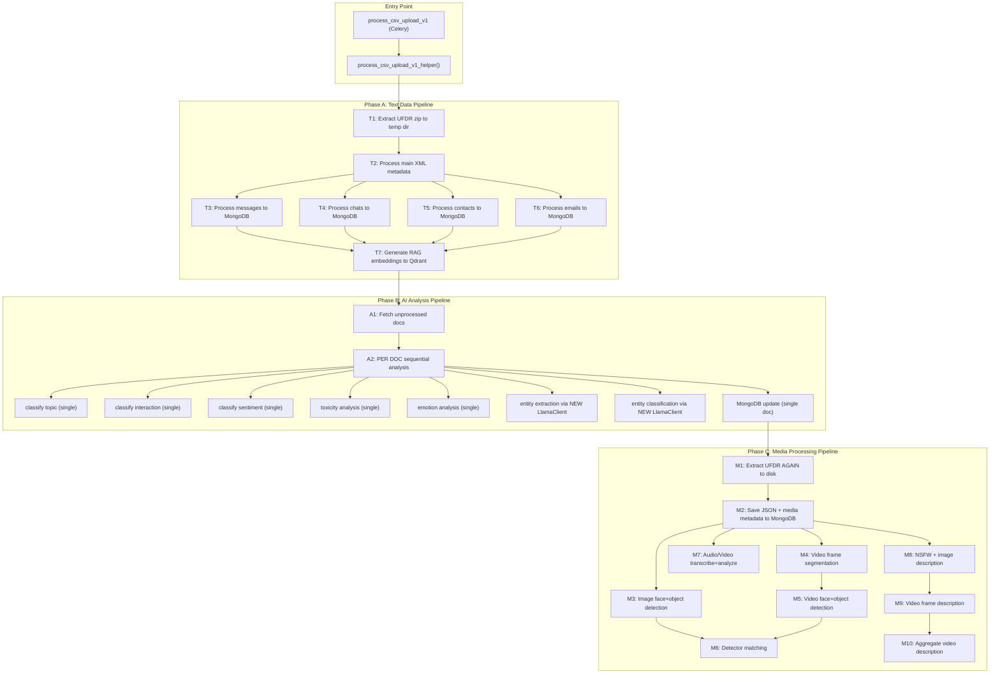
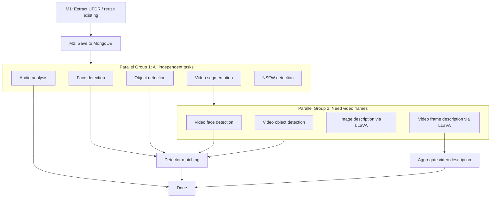

# UFDR Pipeline Deep Optimization Plan

## Complete Pipeline Step Trace (UFDR Only)

The UFDR pipeline has **three sequential mega-phases** triggered from `process_csv_upload_v1_helper` in [utils/celery_helpers.py](utils/celery_helpers.py) (lines 2338-2446):




### Detailed Step-by-Step Trace with Inputs/Outputs

**PHASE A - Text Data Pipeline** ([ufdr_ingester.py](ufdr_ingester.py) `ingest_ufdr_file`, line 2008):

- **T1**: Extract UFDR zip -> temp directory (sequential, I/O bound)
- **T2**: Parse main XML -> device metadata to MongoDB (sequential)
- **T3**: Process messages (XML/JSON/TXT) -> insert to MongoDB **one by one** (lines 2144-2300)
- **T4**: Process chats -> insert to MongoDB **one by one**
- **T5**: Process contacts -> insert to MongoDB **one by one**
- **T6**: Process emails -> insert to MongoDB **one by one**
- **T7**: `ingest_rag_data()` (line 2870) -> for EACH doc: generate embedding -> upsert to Qdrant. **Uses `multi_gpu_opt.get_system_resources()` and `calculate_optimal_batch_size()` redundantly** (lines 2917-2941)

**PHASE B - AI Analysis Pipeline** ([analyzer_v1.py](analyzer_v1.py) `process_documents`, line 1106):

- **A1**: Fetch all unprocessed docs from MongoDB
- **A2**: `asyncio.gather(*[process_single_document(doc) for doc in documents])` (line 1178) - runs all docs "concurrently" but each doc internally does:
  - `classifier_client.classify(text, topics)` - **SINGLE doc** (line 494)
  - `classifier_client.classify(text, interactions)` - **SINGLE doc** (line 497)
  - `classifier_client.classify(text, sentiments)` - **SINGLE doc** (line 500)
  - `toxic_client.analyze_toxicity(text)` - **SINGLE doc** (line 542)
  - `emotion_client.analyze_sentiment(text)` - **SINGLE doc** (line 554)
  - `extract_entities(text)` - creates **NEW `LlamaClient()**` each call (line 279)
  - `classify_entities(entities)` - creates **NEW `LlamaClient()**` each call (line 351)
  - `collection_case.update_one()` - **ONE MongoDB update** per doc (line 1094)

**PHASE C - Media Processing Pipeline** ([celery_tasks.py](tasks/celery_tasks.py) `process_ufdr_upload`, line 594):

- **M1**: `extract_ufdr_file_task` - extracts the UFDR **AGAIN** (already done in T1)
- **M2**: `save_extracted_ufdr_data_task` - saves JSON + media file metadata to MongoDB
- **M3**: `group(detect_faces_task, detect_objects_task)` - parallel image detection
- **M4**: `segment_video_in_frames_task` - extract video frames
- **M5**: `group(detect_video_faces_task, detect_video_objects_task)` - parallel video detection
- **M6**: `process_detector_matches_task` - match detections against detectors
- **M7**: `group(analyze_audio_task, analyze_video_task)` - each creates **NEW `ArabicSocialAnalyzerV1**` (lines 892-906, 972-986), processes items **sequentially**:
  - Per audio/video: `transcribe()` -> `analyze_content()` (full sequential AI pipeline) -> `embedding` -> `qdrant_upsert` (one by one)
- **M8**: `group(detect_nsfw_images_task, generate_image_description_llava_task)`:
  - Per photo: `llava_client.describe_image()` -> `llama_client.extract_entities()` -> `llama_client.classify_entities()` -> `analyzer_client.analyze_content()` -> `embedding` -> `qdrant_upsert` (all **sequential per photo**)
- **M9**: `generate_video_frame_description_llava_task` - same as M8 but per screenshot
- **M10**: `generate_video_description_task` - aggregates frame descriptions

---

## Critical Problems Identified

### P1: Batch methods exist but are NEVER used in the pipeline

- `classify_batch()` added to [XlmRobertaLargeXnli.py](clients/classifier/XlmRobertaLargeXnli.py) - **never called**
- `analyze_toxicity_batch()` in [AkhooliXLMLargeArabicToxic.py](clients/toxic/AkhooliXLMLargeArabicToxic.py) - **never called**
- `analyze_sentiment_batch()` in [TwitterXlmRobertaBaseSentiment.py](clients/emotion/TwitterXlmRobertaBaseSentiment.py) - **never called**
- `create_embeddings_batch()` in [MiniLML12v2.py](clients/embeddings/MiniLML12v2.py) - **never called**

### P2: multi_gpu_opt.py is redundant with settings.compute_config

Imported in 4 files but duplicates what `settings.compute_config` already provides:

- [analyzer_v1.py](analyzer_v1.py) line 36: `optimize_for_system_resources, get_system_resources`
- [ufdr_ingester.py](ufdr_ingester.py) line 2917: `get_system_resources, calculate_optimal_batch_size`
- [parallel_processor.py](parallel_processor.py) line 17: all three functions
- [rag_v1.py](rag_v1.py) line 17: `optimize_for_system_resources`

### P3: ModelRegistry created but never integrated

[model_registry.py](model_registry.py) was created but zero files import or use it.

### P4: AI analysis is fully sequential per document

[analyzer_v1.py](analyzer_v1.py) `analyze_content()` (line 470) runs 3 classifier calls + 1 toxic + 1 emotion + 2 LLM calls **sequentially** per document. For 100K docs, that's 700K sequential model calls.

### P5: LlamaClient re-instantiated per document

[analyzer_v1.py](analyzer_v1.py) lines 279 and 351 create `LlamaClient()` for every entity extraction/classification call. This is the **sync** client, not `AsyncLlamaClient`.

### P6: UFDR extracted twice

Once in `ingest_ufdr_file()` (Phase A, T1) and again in `extract_ufdr_file_task` (Phase C, M1).

### P7: ArabicSocialAnalyzer created with `use_parallel_processing=False`

[utils/celery_helpers.py](utils/celery_helpers.py) line 2382 explicitly disables parallelism.

### P8: MongoDB updates are one-doc-at-a-time

In `process_single_document()` line 1094, each doc does an individual `update_one()`.

### P9: RAG embeddings generated one-by-one

[ufdr_ingester.py](ufdr_ingester.py) `ingest_rag_data()` line 2951-2976 processes each doc individually despite the embedding client supporting batches.

### P10: CUDA optimizations not centralized

`cudnn.benchmark`, `tf32`, `matmul` optimizations are only set inside `multi_gpu_opt.optimize_for_system_resources()` (lines 474-481) and may not run in all code paths.

---

## Optimization Plan

### Phase 1: Eliminate multi_gpu_opt.py Redundancy

**Goal**: Single source of truth for system resources via `settings.compute_config`.

- **1.1**: Remove all imports of `multi_gpu_opt` from [analyzer_v1.py](analyzer_v1.py), [ufdr_ingester.py](ufdr_ingester.py), [parallel_processor.py](parallel_processor.py), [rag_v1.py](rag_v1.py)
- **1.2**: Replace every call to `optimize_for_system_resources()`, `get_system_resources()`, `calculate_optimal_batch_size()` with `settings.compute_config`
- **1.3**: Move the CUDA optimization flags (`cudnn.benchmark`, `tf32`, `matmul`) from `multi_gpu_opt.py` into a startup hook in [config/settings.py](config/settings.py) `compute_config` property so they're always set on first access
- **1.4**: Delete or deprecate `GPUManager`, `BatchProcessor` classes from [multi_gpu_opt.py](multi_gpu_opt.py) since they're unused outside the module. Keep `log_gpu_utilization()` if useful for monitoring

### Phase 2: Batch AI Analysis in analyzer_v1.py (BIGGEST IMPACT)

**Goal**: Process all documents in GPU-optimal batches instead of one-at-a-time.

This is the single highest-impact change. Currently for N documents, the pipeline makes **7N sequential model calls**. With batching, it becomes **~7 batched calls**.

- **2.1**: Refactor [analyzer_v1.py](analyzer_v1.py) `process_documents()` to extract ALL texts first, then run batched inference:
  ```python
  # Instead of: asyncio.gather(*[process_single_document(doc) for doc in documents])
  # Do:
  texts = [preprocess_text(doc.get("Preview Text", "")) for doc in documents]

  # Batch GPU inference (all at once)
  topic_results = self.classifier_client.classify_batch(texts, topic_labels)
  interaction_results = self.classifier_client.classify_batch(texts, interaction_labels)
  sentiment_results = self.classifier_client.classify_batch(texts, sentiment_labels)
  toxicity_results = self.toxic_client.analyze_toxicity_batch(texts)
  emotion_results = self.emotion_client.analyze_sentiment_batch(texts)
  ```
- **2.2**: Replace sync `LlamaClient` with `AsyncLlamaClient` for entity extraction/classification. Use `process_batch_entities_async()` which already exists in [async_llama_client.py](clients/llama/async_llama_client.py) line 374
- **2.3**: Batch MongoDB updates using `bulk_write()` with `UpdateOne` operations instead of individual `update_one()` per document
- **2.4**: Add a new `process_documents_batched()` method that orchestrates the above, keeping `process_single_document()` as fallback

### Phase 3: Batch RAG Embedding Generation

**Goal**: Use `create_embeddings_batch()` instead of per-doc embedding generation.

- **3.1**: Refactor [ufdr_ingester.py](ufdr_ingester.py) `ingest_rag_data()` (line 2870) to:
  - Collect all texts from documents into a list
  - Call `embedding_client.create_embeddings_batch(all_texts, batch_size=compute["embedding_batch_size"])` 
  - Batch-upsert points to Qdrant
  - Replace `multi_gpu_opt` imports with `settings.compute_config`
- **3.2**: Apply same pattern in [rag_v1.py](rag_v1.py) — replace `optimize_for_system_resources()` with `settings.compute_config`, use batch embedding generation

### Phase 4: Integrate ModelRegistry into Pipeline

**Goal**: Prevent model re-instantiation across tasks.

- **4.1**: Update [analyzer_v1.py](analyzer_v1.py) `__init__` to use `ModelRegistry.get_model()` instead of `get_classifier_client()`, `get_toxic_client()`, `get_emotion_client()` directly
- **4.2**: Update media task functions in [celery_tasks.py](tasks/celery_tasks.py) to use `ModelRegistry` for `get_face_detector_client`, `get_object_detector_client`, `get_transcriber_client`, `get_llava_client`, `get_llama_client` — each of these is currently re-instantiated per task
- **4.3**: Add Celery `worker_process_init` signal in [celery_app.py](celery_app.py) to preload common models on worker startup

### Phase 5: Eliminate Duplicate UFDR Extraction

**Goal**: Extract UFDR once, reuse the output.

- **5.1**: In [utils/celery_helpers.py](utils/celery_helpers.py) `process_csv_upload_v1_helper()`, after `ingest_ufdr_file()` completes, pass the existing extraction path (`folder_path`) to `process_ufdr_upload.delay()` and skip `extract_ufdr_file_task` in the Celery chain
- **5.2**: Alternatively, restructure the Celery workflow so that `extract_ufdr_file_task` only runs if the data isn't already extracted (check if output path exists)

### Phase 6: Optimize Media Analysis Inner Loops

**Goal**: Batch AI analysis within media processing tasks.

- **6.1**: In [utils/celery_helpers.py](utils/celery_helpers.py) `analyze_audio_async()` (line 1458): Collect all transcriptions first, then run `analyze_content` in batch mode instead of per-audio
- **6.2**: In `analyze_video_async()` (line 1589): Same pattern — transcribe all, then batch-analyze
- **6.3**: In `generate_image_description_llava_async()` (line 1828): Collect all LLaVA descriptions, then batch entity extraction + batch classification + batch analysis + batch embedding
- **6.4**: In `generate_video_frame_description_llava_async()` (line 1995): Same batching pattern
- **6.5**: In all above functions, batch-upsert Qdrant points instead of one-by-one

### Phase 7: Enable Parallel Processing in Analyzer

**Goal**: Flip the parallelism switch and use AsyncLlamaClient.

- **7.1**: In [utils/celery_helpers.py](utils/celery_helpers.py) line 2382, change `use_parallel_processing=False` to `True` for the `ArabicSocialAnalyzer` 
- **7.2**: In every Celery task that creates `ArabicSocialAnalyzerV1` (analyze_audio_task, analyze_video_task, generate_image_description_llava_task, generate_video_frame_description_llava_task, generate_video_description_task), set `use_parallel_processing=True`
- **7.3**: Ensure `parallel_processor.py` `process_case_parallel()` uses the batch methods from Phase 2

### Phase 8: CUDA and Memory Optimizations

**Goal**: Ensure GPU is maximally utilized.

- **8.1**: Add global CUDA optimization flags to [config/settings.py](config/settings.py) `compute_config` property:
  - `torch.backends.cudnn.benchmark = True`
  - `torch.backends.cuda.matmul.allow_tf32 = True`
  - `torch.backends.cudnn.allow_tf32 = True`
- **8.2**: Add `torch.inference_mode()` context manager (faster than `no_grad()`) in batch inference methods
- **8.3**: Enable FP16 inference in transformer models (classifier, toxic, emotion) — RTX 5090 has excellent FP16 throughput
- **8.4**: Add periodic `torch.cuda.empty_cache()` between phases to prevent VRAM fragmentation

### Phase 9: Restructure Celery Workflow Dependencies

**Goal**: More aggressive parallelization in the Celery chain.

Current chain forces unnecessary sequential dependencies. The optimized flow:




Key changes:

- Audio analysis (M7a) can start immediately after M2 (doesn't need detection results)
- Image description (M8b) can start immediately after M2
- NSFW detection can start immediately after M2
- Video frame description (M9) needs M4 done, but NOT M3/M5/M6

---

## Expected Impact per Phase

- **Phase 1** (multi_gpu_opt cleanup): Code hygiene, no perf change
- **Phase 2** (batch AI analysis): **50-100x speedup** for text analysis — from 7N sequential model calls to ~7 batched calls for N docs
- **Phase 3** (batch embeddings): **10-20x speedup** for RAG ingestion
- **Phase 4** (ModelRegistry): **2-5x speedup** from avoiding model reload per task
- **Phase 5** (no double extraction): **Saves minutes** per UFDR file
- **Phase 6** (media batch analysis): **10-50x speedup** for media text analysis
- **Phase 7** (enable parallelism): Unlocks pipeline concurrency
- **Phase 8** (CUDA optimizations): **1.5-2x speedup** for all GPU inference
- **Phase 9** (Celery restructure): **30-50% wall-clock reduction** for media pipeline

